# KiCAD Workshop (ELSOC '17)

## What You'll Need

- A computer (Windows/Mac/Linux)
- A 3-button mouse (Useful, but not necessary)
- Motivation to build the best darn PCB in existance

## Prelude - Installing KiCAD

Grab it here: [http://kicad-pcb.org/download/](http://kicad-pcb.org/download/)

There are binaries available for all major operating systems.

### Special note - Linux users

If you are using Linux, you may additionally want to install `kicad-library` & `kicad-library-3d` as these aren't included by default.

## Extra Stuff (for before the workshop)

- What are we building?
    - Basically a simple board with a micro, a DAC and some LEDs.
- Millimeters, mils, thou, copper ounces
- PCB layers (what is solder mask? silkscreen?)

# Creating a Project

- Fire up `kicad`.
- In the main window: *File -> New Project -> New Project*.
- Select some empty folder on your machine.
- Give it a name 'i_heart_kicad' (or whatever you want)

If KiCAD asks if it should 'create a new directory', hit *yes*.

You should now have a `<yourname>.pro` file in left pane of the KiCAD window.

# Working with the schematic editor

- Make sure `<yourname>.pro` is selected in the left pane.
- Hit the leftmost button on the pane of big icon buttons 'Eeschema...' (it has a picture of a schematic.)
- If KiCAD complains that the schematic does not exist, hit 'Yes' to create it.
- You should be greeted with a nice blank schematic.

## Moving around

- Scroll to zoom in and out, hold down your middle mouse button to pan.
    - If you don't have a middle mouse button, you can hold down F4 do do the same.

## Take a quick look at the tools

- Hover your mouse over icons on the right to see what things are, do a bit of exploration
- Protip: all these commands have hotkeys. Type `?` to see all of KiCAD's hotkeys.

## Task 1: Building a buffered LED

Most microcontrollers can only source/sink ~10mA on their pins. What if we wanted to use a really high-brightness LED that needed ~50mA?

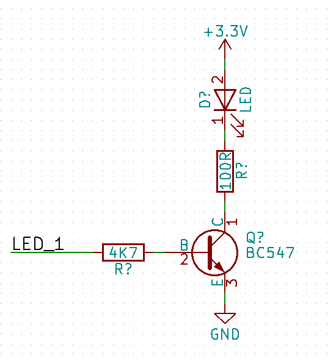

Your task is to build this very simple circuit.

### Useful commands:

Protip - press 'escape' at any time to cancel whatever you're currently doing.

- Click the 'place component' button (picture of an op-amp) to place a part (or use `Shift-A`)
    - Then search for a part in the 'filter' field.
    - Protip - search 'LED' for an LED, 'R' for a resistor, and 'BC547' for a jellybean transistor.
    - While you are placing a component, you can:
        - Press 'r' to rotate the component
        - Press 'x' or 'y' to mirror a component along that axis
    - Click again to actually drop the component
- If you have already placed a component but you want to pick it up again, hover over it with the mouse, and press 'm' to start moving it again.
- To change component values (i.e the resistance), hover over the component and either right click, *Edit Component -> Value* OR just hover over the component and press 'v'.
- To place +3.3V or ground (power ports), use the 'Place power port' button (picture of ground)
    - Search 'GND' for a ground, search '3' to find the '+3.3V' port.
- To wire things together, press 'w' or use the 'Place wire' button (picture of a green diagonal line)
- To place a net label, first place a length of wire. To cancel it without actually connecting it to something - hit 'k', or right click and press 'end wire'.
    - Now you can add a net label by using the 'Place net name' button (Letter A above green line)
    - Click on the end of the wire that is not connected, and name your net label.

Net labels are very useful for connecting different parts of your schematic without it looking like spaghetti.

## Task 2: Copying & Duplicating

We want more than 1 LED! We want this: (Note the different net names!)

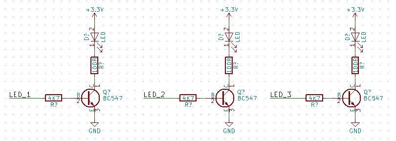

Your task is to do this using copying commands.

### Useful commands:

- Box-select multiple components by clicking, dragging.
    - Once you have the components selected, right click, hit 'copy' to create a duplicate. Click again somewhere else to place it.
- Copying individual components is also possible. Hover over a component and press 'c'.
- To modify the 'LED_X' net labels, hover over the label and press 'e' to edit it (or right-click on it, and hit 'edit label').

## Task 3: Creating our own Symbol

### Symbols & Footprints

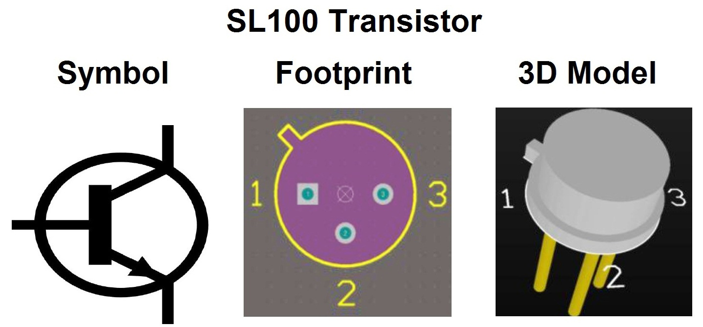

*Symbols* are the pretty drawings you see for each component on the schematic. *Footprints* are how the pins are physically laid out -> i.e the pattern we need on the PCB for it to actually fit. In KiCAD, these 2 things are completely detached, however for each part you will end up needing both a symbol and a footprint.

### What we will make

Lets pretend our project needs a Digital-to-Analog-Converter (DAC). So we are going to make a symbol for the MCP4725 I2C DAC built by Microchip:

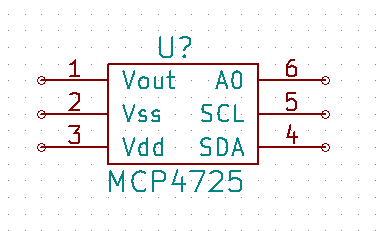

Take a look at the datasheet here: [MCP4725 Datasheet](http://ww1.microchip.com/downloads/en/DeviceDoc/22039d.pdf)

### Using the library editor

- Open the library editor from either the main KiCAD window or the schematic editor (picture of the book with a pencil at the top-right ish)
- Create a new component by clicking the 'Create new component' button at the top left (op amp picture)
- Give the component a name - 'MCP4725', press OK. You might want to zoom in a bit.
- Now you need to create some pins. Look at the MCP4725 datasheet above, the pinout is on page 1.
- Click the 'Add pins to component' button (top-ish of right toolbar)
    - Click somewhere to make a pin
    - Name the pin (i.e 'Vout'), and give it the correct number (i.e '1') according to the datasheet.
    - It is good practice to also set the pin type so that KiCAD can check your circuit for electrical errors later.
    - Click to place the pin after you press OK.
- Protip - most of the controls are the same as the schematic editor ('e' to edit 'm' to move, 'r' to rotate etc etc)
- Note the pin types!
    - Vout is an output, Vss/Vdd are power pins, A0 is an input, SCL and SDA are open-collector. (bonus question - how do we know this?)
    - You can be lazy and just set them all to passive, but it will be harder for KiCAD to check your circuit for errors.
- You can use the rectangle tool to place a nice border around your symbol.

### Saving your snazzy new symbol

- In the top toolbar of icons, there is a book 'Save current component to new library'. Click it.
- Save it into the same directory as your project. The default library name should be fine.
- You will get a warning saying your library will not be loaded. That's fine.
- Now you can close the library editor. *File -> Quit*

### Adding the new symbol to our project

- Back in the schematic editor...
- First we have to add our new library to the schematic project
    - *Preferences -> Component Libraries -> Add*
    - Browse to where you saved your `MCP4725.lib` file, select it, OK.
    - OK again to the library files window.
- Now you can place your new part using the normal part placing tool. Nice!

### Protip - Check if your symbol/footprint already exists!

Making a symbol/footprint is often our *Last Resort* - it takes a lot of time! Other than the basic internal library that KiCAD comes with, where else can we find symbols?

- KiCAD has an extended library that isn't included by default. You can add it by going:
    - *Preferences (top bar) -> Component Libraries -> Add*
    - There is lots of good stuff in those libraries. You can add all of them and search for your part if you want.
    - (Example, STM32 microcontrollers aren't included in the base library, but they are in the extended one)
- There are a few online websites where you can download symbols for free, for example [https://www.snapeda.com/](https://www.snapeda.com/) is quite good and has KiCAD support.
    - (Example, 'HSMF-C114' RGB led is in none of the KiCAD libraries, but it is on this site)
- Sometimes component distributors (Digikey/Element14) include symbols/footprints in their part data sections.

## Task 4: Bringing things together

### Adding a microcontroller

In this project we will use the STM32F030F4 microcontroller from ST. Your task is to add it to our sheet:

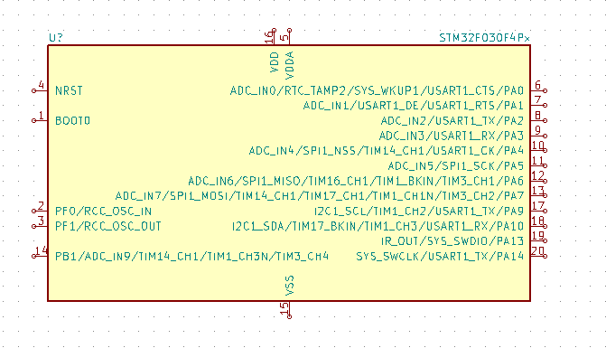

- If you search for the chip you will find it is not in the KiCAD base library. Luckily, it is in the extended library!
    - *Preferences (top bar) -> Component Libraries -> Add*
    - There is a library called `stm32`. Add it.
    - Now you should be able to find the STM32F030F4 microcontroller when you place a part.

### Connecting up the DAC

We want to send the DAC output to a connector, and have it talk to our microcontroller over I2C. Try and replicate this:

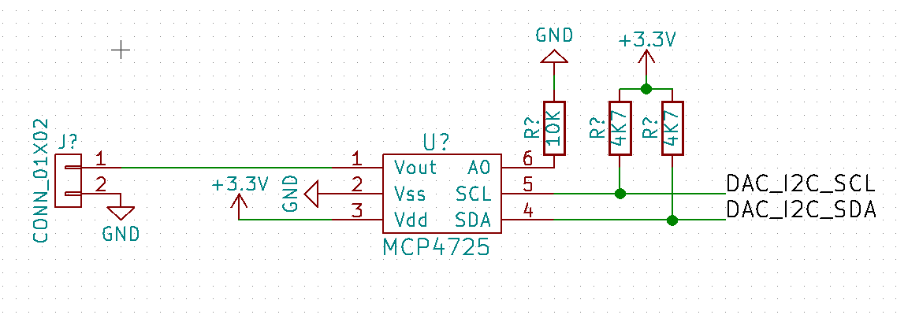

Bonus question - why do we need the pull-up resistors?

#### Tips
- To find the connector symbol, look in the 'conn' part category
- Be careful with junctions! If you have a point where 3 wires meet, and a junction doesn't appear, you might have to add it manually. Use the 'place junction' tool (above the place net name tool).

### Hooking up the microcontroller

Now we want to connect the heart of the circuit to everything else! Try and replicate this:

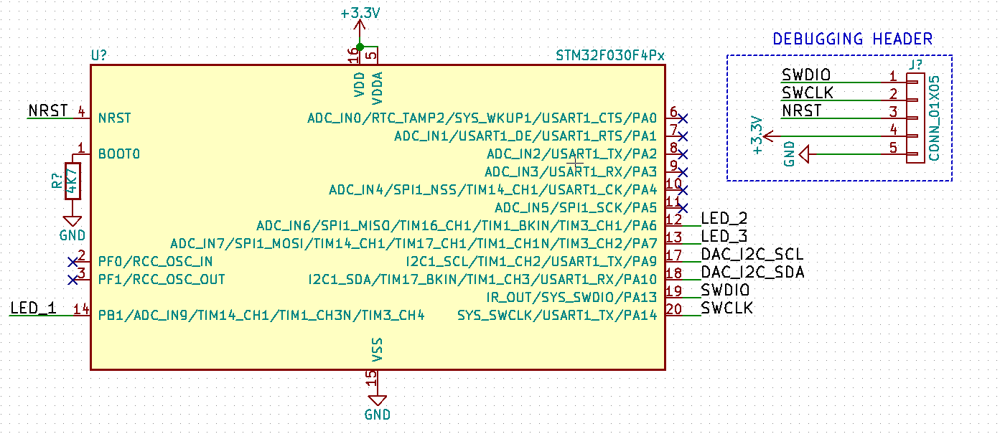

#### Tips
- Use the (blue X) button in the right toolbar to place 'no-connect' symbols. These are used by the Electrical Rule checker to see if you made any mistakes.
- Use the (blue dotted line) button to place lines, and the (big T) button to place text. This is very useful for indicating parts of your schematic.

(Question - what is this circuit missing that we should probably add?)

### Annotating your schematic

You will notice that all the parts have 'R?' or 'U?' designators next to them. This isn't great, because KiCAD is unable to easily distinguish between the parts for electrical rule checking, and for generating a netlist (which we will do later).

- To annotate your schematic:
    - *Tools -> Annotate Schematic*
    - All the default options are usually fine
    - Click 'Annotate' and 'OK'
    - Now all your parts will have nice numbers

Tip: If you later accidentally annotate part of your schematic, you can clear them with this same window.
Tip2: Sometimes it makes more sense to annotate parts based on the physical layout than the schematic. We might look at that later.

### Admire your hard work

All going well, you should now have something like this:

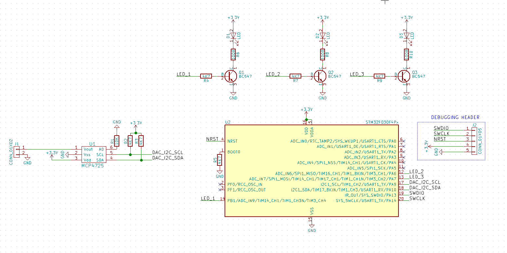

## Task 5: Playing with the Electrical Rule Checker (ERC)

### Did you make a mistake?

Now that everything looks good, you can run the ERC to see if you have made any (easily detectable) errors.

- *Tools -> Electrical Rules Checker*
    - Hit 'Run'
- You will probably get some errors like 'Pin connected to some other pins but no pin to drive it'
    - This is because KiCAD thinks that we have no supply for our GND or +3V3 rails.

- To fix this, we can place a special power port (same command as for GND/3.3V parts)
    - Search for 'PWR_FLAG'

You want to make something like this:

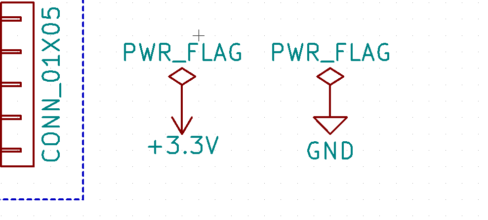

This indicates to KiCAD that a supply is available (in our case from the debugging connector).

### What sorts of things can ERC check?

- Try a few things and see what happens when you run ERC:
    - Deleting a ground or supply rail from the DAC or microcontroller.
    - Deleting one of the 'no-connect' symbols on the microcontroller.
    - Change one of the LED net labels to 'LEED_1' (a typo) (on one wire, not both wires)

Summary: ERC can help you with all sorts of things, explore it some more with your own project if you're interested.

# Working with the PCB editor

(Note for these next couple of tasks we are still in the schematic editor, but we are now preparing it for layout)

## Task 6: Picking our footprints

At the moment our schematic only has symbols - before putting our PCB together, we need to associate each symbol with a *footprint*.

- *Tools -> Assign Component Footprint*

You will get a window of all your parts ready to be assigned. Your challenge: try and copy this --

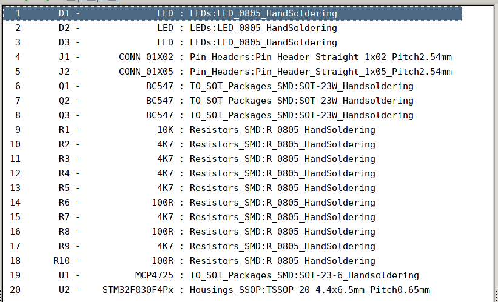

- To assign a footprint, select a part in the middle and then pick a footprint from the right window.
- At the top of the window there are a few useful buttons that will let you filter footprints.

### Tips

- You might need to *filter by library* and choose 'TO_SOT_Packages_SMD' to find the SOT-23 packages for the transistors and DAC.
- Generally you want to choose the hand-soldering footprints unless you are a soldering god or have a reflow oven.
- Always double-check your footprints/schematic symbols against your datasheet (i.e pin ordering!)

### Once you are finished

- Hit the top left (green down arrow) button to save your footprint associations.
    - Then *File->Close* to exit that window.

## Task 7: Layout our PCB

Protip -> many of the shortcuts in the PCB editor are the same (movement, panning etc).

### Generating and importing our netlist

First, we have to generate a netlist in the schematic editor. This is read by KiCAD's PCB editor later to figure out which parts to place, and what the connections are.

- Click the 'NET' icon in the top right of the schematic editor.
    - Click 'Generate'
    - Save the netlist in the same folder as your project. The default is usually fine.

It's time to move to our PCB!

- Hit the 'Run PCBNew' button (it's at the top right, picture of pencil on PCB).
    - Now you are in the PCB editor. But it is pretty boring at the moment
    - Click the 'NET' button at the top right of the PCB editor
        - Hit 'Read Current Netlist', hit 'yes' if it asks.
    - Your parts are now on your PCB, but they are all clumped up!

### Spreading out our parts

We have parts, but they are all clumped up!

- To separate all our parts
    - switch to Footprint Mode (right-ish of top toolbar, chip with 4 arrows - make sure it is pressed)
    - Right click anywhere (not on a component)
        - *Global Spread & Place->Spread Out All Footprints*
        - Hit 'Yes'
        - your parts should now be all nicely spread out.
    - Exit global footprint placement mode at any time by depressing the mode button from earlier

Now we just need somewhere to put them...

### Placing the board outline

We want to create a nice board outline, like this:

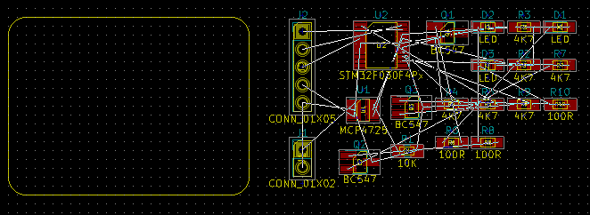

- First select the 'Edge.Cuts' layer by clicking it on the right layer window.
- You can draw a simple edge by using the line tool (blue dotted line, right toolbar)
- You can use the circle or arc tools to make things more interesting
- Try using the arc tool to round your edges.
- Note: make sure you aren't in *Global Footprint Placement* mode if you try to move edge lines.

For fun - check out your fancy board outline in the 3D viewer with *View->3D View*
- Some parts will have the wrong rotation. This is a KiCAD library bug, don't worry about it.
- To make it look prettier:
    - *Preferences*: Tick 'Realistic Mode'
    - *Preferences*: Tick 'Show Copper Thickness'
    - *Preferences*: Untick 'Show 3D Models' (to remove the ugliness)

### Laying out your parts

Go for your life! Doesn't have to exactly match what I show here:

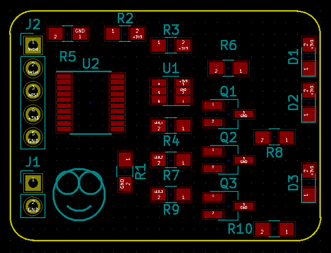

#### Useful commands

- Use the regular 'M' (move), 'R' (rotate) tools to move things around.
- Tip: this is easier in *Global Footprint Placement* mode, as you won't accidentally pick up stray pads quite as much.

#### Tip: filtering out what matters

- A lot of the stuff you will see on your PCB in the designer window will not actually show up on your final PCB.
- On the right *Layer/Render* pane:
    - In 'Layer', you most often only need:
        - F.Cu / B.Cu (Front & bottom copper)
        - F.SilkS / B.SilkS
        - Edge.Cuts
    - In 'Render', you most often only need:
        - Everything except 'Values', unless you really want the extra clutter.

#### Sidenote: Mounting holes & decals

- You can add extra footprints like mounting holes using the *Add Footprints* button in the right toolbar.
- Add the CE/FCC logo if you want to be really naughty!

### Adding some zones

For EMC/EMI, heat dissipation and to make routing easier - it's often beneficial to make ground or power planes.
In this design we will just use 2 ground planes.

We want this:

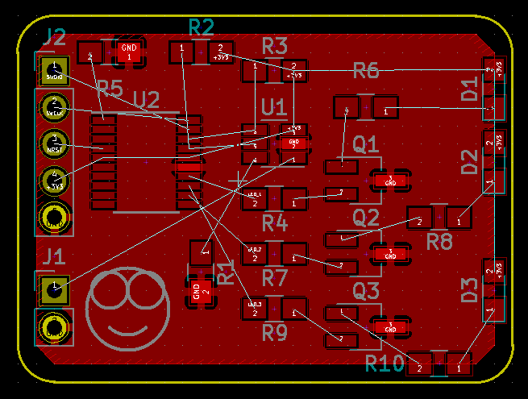

- To place a zone, use the 'Place Filled Zone' tool in the right toolbar.
    - Click somewhere to start placing the zone.
        - In the dialog that pops up, select the 'GND' net.
        - Choose the top copper layer (F.Cu)
    - Click at points to create your polygon.
        - When finished, right click and choose 'Close Zone Outline'
    - Now you have a zone. To fill it in (make sure to still have the zone tool enabled)
        - Right-click and hit 'Refill/Fill all Zones' (or press 'B')

- The problem now is that the zone clearances are so high it misses some pins on the chip!
    - Switch back to the normal arrow tool
    - Right click on the zone (border!)
        - *Zones->Edit Zone Properties*
        - Change the clearance to something like 0.254mm / 10 mil
- To copy that zone onto the bottom layer:
    - Right click on the zone (border!)
        - *Zones->Duplicate Zone Onto Layer*

- Note: having both these zones can make it hard to see anything
    - Make things easier to see by selecting one of the nicer zone visibility options on the left toolbar.

### Routing your PCB

## Extra Stuff (for after the workshop if time permits)

- KiCAD's heirarchical design features
    - Multi-schematic designs with a heirarchy
    - Multi-schematic designs that are flat

- Buying a PCB, all the settings..
    - Materials (FR4, aluminium, rogers)
    - Copper thickness
    - Silkscreen
    - Surface finish (HASL is fine for prototypes)
    - Clearances
    - Drill sizes

- Via tenting
- Stencilling jigs
- V-Scoring
- Soldering tips
- Test jigs (i.e pogo pins)
- Fiducials & general DFM
- Microstrip elements, inductors & capacitive touch sensors
- Shameless self-advertisement

## Where to get help (after this workshop)

KiCAD is very google-friendly as it's an open-source project. Chances are someone's already asked the same question.

If you're stuck on some basics or still getting lost in menus, I strongly recommend this awesome video tutorial to refresh your memory: [https://www.youtube.com/watch?v=zK3rDhJqMu0](https://www.youtube.com/watch?v=zK3rDhJqMu0)

There are also comprehensive manuals on KiCAD's web page.
